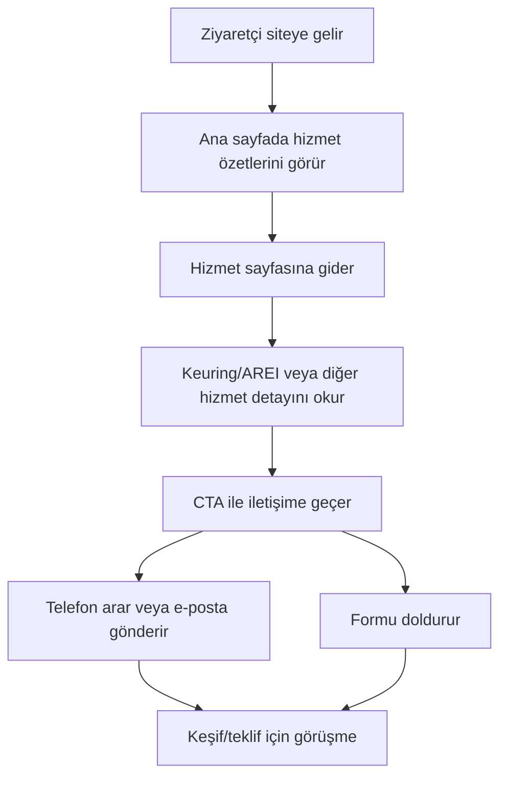

## 1. Ürün Özeti
Regio Antwerpen’de hizmet veren Elektromax için modern, güven veren ve hızlı iletişime yönlendiren kurumsal web sitesi.
- Hedef: Hizmetleri anlaşılır biçimde sunmak, keuring/AREI hazırlığı uzmanlığını öne çıkarmak ve teklif/randevu dönüşümlerini artırmak
- Hedef kitle: Ev sahipleri, apartman yöneticileri (syndicus), KOBİ’ler, müteahhit/şantiye firmaları

## 2. Temel Özellikler

### 2.1 Kullanıcı Rolleri
[Rol ayrımı gerekli değil]

### 2.2 Özellik Modülleri
1. **Ana Sayfa**: Hero alanı, hizmet özetleri, güven unsurları, hızlı CTA’lar
2. **Hizmet Detayları**: Genel elektrik işleri, Keuring/AREI hazırlığı, Yeni bina & şantiye tesisatı, EV şarj istasyonu, Kamera & interkom
3. **Projeler/Referanslar**: Örnek proje tipleri, kısa proje kartları
4. **Hakkımızda**: Firma yaklaşımı, değerler, bölgesel odak
5. **İletişim**: Telefon/e-posta/sosyal medya, iletişim formu, hızlı CTA

### 2.3 Sayfa Detayları
| Sayfa Adı | Modül Adı | Özellik Açıklaması |
|---|---|---|
| Ana Sayfa | Hero | “Antwerpen + hizmet + sonuç” odaklı H1, kısa değer önerisi, iki ana CTA |
| Ana Sayfa | Hizmet Kısa Liste | 5–6 ana hizmet kartı; her karttan ilgili hizmet sayfasına geçiş |
| Ana Sayfa | Güven Unsurları | AREI uyumu, güvenlik odak, yerel hizmet vurgusu; ikonlu kısa maddeler |
| Ana Sayfa | Hedef Kitle Bölümü | Ev sahibi/syndicus/işletme/şantiye için kısa fayda mesajları |
| Hizmetler | Detay İçerik | Her hizmet için problem → çözüm → süreç → faydalar yapısı, ilgili CTA |
| Hizmetler | SEO Metin Blokları | “Elektricien Antwerpen” ve “algemene elektriciteitswerken regio Antwerpen” ifadelerini doğal şekilde kullanma |
| Projeler | Proje Kartları | 4–8 proje kartı; kısa başlık + 2–3 cümle açıklama; görseller sonradan eklenebilir alan |
| Hakkımızda | Hikaye & Değerler | Tecrübe vurgusu (tarih vermeden), çalışma prensipleri, yerel odak |
| İletişim | İletişim Bilgileri | Telefon, e-posta, Instagram & X kullanıcı adı; tek tıkla kopyala/çağrı |
| İletişim | Form | Basit iletişim formu, doğrulama, gönderim sonrası başarı mesajı |

## 3. Temel Akış
Ziyaretçi, ana sayfadan hizmetleri inceler ve hızlıca iletişime geçer; ayrıca keuring/AREI hazırlığı hizmetine özel CTA ile randevu talep eder.

## 4. Arayüz Tasarımı

### 4.1 Tasarım Stili
- Genel yaklaşım: “Modern endüstriyel” görünüm; net tipografi, güçlü kontrast, düzenli boşluk kullanımı
- Renk paleti: Koyu nötr zemin + elektrik vurgusu (örn. koyu antrasit/zinc tonları + elektrik sarısı/yeşili vurgu) ve sıcak metalik ikincil vurgu
- Buton stili: Köşeleri hafif yuvarlatılmış, yüksek kontrast; hover’da parlama/ışık çizgisi efekti
- Tipografi: Karakterli bir başlık fontu + okunaklı gövde fontu; 4–5 kademeli hiyerarşi
- Yerel güven duygusu: Antwerpen vurgusu; harita zorunlu değil, ancak bölge etiketleri kullanılabilir

### 4.2 Sayfa Tasarım Özeti
| Sayfa Adı | Modül Adı | UI Öğeleri |
|---|---|---|
| Ana Sayfa | Hero | Büyük başlık, kısa açıklama, iki CTA, arka plan dokusu/ışık geçişi, hafif animasyonlu giriş |
| Ana Sayfa | Hizmet Kartları | İkonlu kartlar, hover etkileşimi, kısa metin, “Detay” linki |
| Hizmetler | İçerik Bölümleri | H2/H3 ile bölümlenmiş metin, kısa listeler, bölüm içi CTA bileşeni |
| Projeler | Kart Grid | Kısa proje kartları, etiketler (örn. “Keuring”, “Şantiye”), görsel alanı rezervi |
| Hakkımızda | Değerler | 3–4 değer kartı, kısa prensip metinleri |
| İletişim | İletişim + Form | Kopyalanabilir iletişim alanları, form doğrulama, başarı/ hata geri bildirimi |

### 4.3 Duyarlılık
Desktop-first tasarım; mobilde tek sütun akış, CTA’ların üstte görünmesi, dokunma hedefleri minimum 44px.
