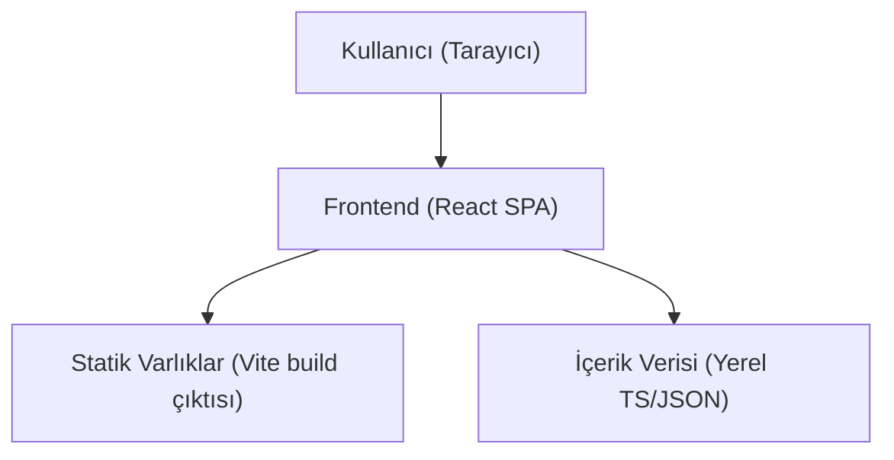

## 1. Mimari Tasarım

## 2. Teknoloji Tanımı
- Frontend: React@18 + TypeScript + react-router-dom + tailwindcss@3
- Başlatma Aracı: vite-init
- Backend: Yok (iletişim formu demo amaçlı; üretimde e-posta servis entegrasyonu opsiyonel)
- Veri: Yerel içerik dosyaları (hizmet metinleri, iletişim bilgileri, SEO metaları)

## 3. Rota Tanımları
| Rota | Amaç |
|---|---|
| / | Ana sayfa ve hızlı CTA’lar |
| /hizmetler | Tüm hizmetleri listeleme |
| /hizmetler/genel-elektrik | Algemene elektriciteitswerken detayı |
| /hizmetler/keuring-arei | Keuring / AREI hazırlığı detayı |
| /hizmetler/yeni-bina-santiye | Yeni bina & şantiye tesisatı detayı |
| /hizmetler/ev-laadpalen | EV şarj istasyonu (EV laadpalen) detayı |
| /hizmetler/kamera-interkom | Camerabewaking + videofonie/parlofonie detayı |
| /projeler | Referanslar / örnek proje tipleri |
| /hakkimizda | Over ons (hakkımızda) |
| /iletisim | İletişim ve form |

## 4. API Tanımları
Backend olmadığı için API yok. Form gönderimi için geliştirme aşamasında “mock submit” kullanılır; üretimde aşağıdaki seçeneklerden biri eklenebilir:
- E-posta servis sağlayıcı (örn. SMTP veya üçüncü parti servis) üzerinden gönderim
- Basit bir Express endpoint’i ile sunucu tarafında gönderim

## 5. Veri Modeli
Uygulama, içerik odaklı olduğu için ilişkisel veri modeli gerektirmez.
- İçerik: sayfa metinleri, hizmet listeleri, SEO başlık/açıklama metaları, iletişim bilgileri
- Yapı: `content` altında modüler TS dosyaları
